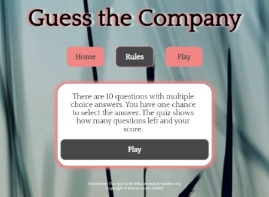
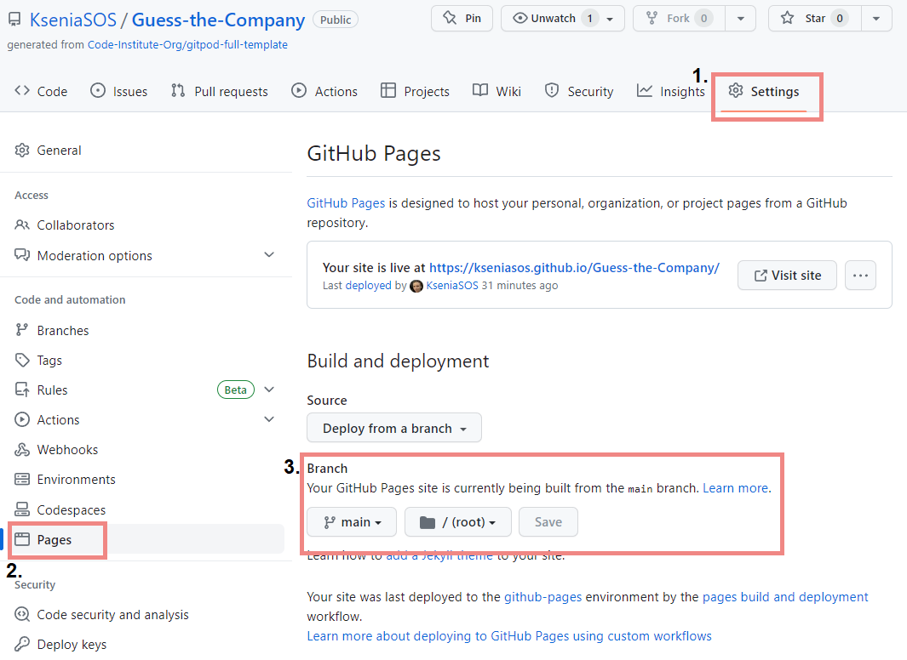

# *Guess The Company*
Guess the Company is a basic multiple choice Quiz. It is aimed at user who want a bit of fun and want to test their knowledge if they can identifying a brand by its slogan. User will find 30 questions.

Visit the live website [*HERE*]( https://kseniasos.github.io/Guess-the-Company/)

# Contents
* [**User Experience UX**](<#user-experience-ux>)    
    * [Wireframes](<#wireframes>)
    * [Site Structure](<#site-structure>)
    * [Design Choices](<#design-choices>)
        *  [Typography](<#typography>)
        *  [Colour Scheme](<#colour-scheme>)
* [**Features**](<#features>)
    * [**Existing Features**](<#existing-features>)
        * [Homepage](<#homepage>)
        * [Rules Page](<#rules-page>)              
        * [Game Page](<#game-page>)        
    * [**Future Features**](<#future-features>)
* [**Technologies Used**](<#technologies-used>)
* [**Testing**](<#testing>)
* [**Deployment**](<#deployment>)
* [**Credits**](<#credits>)
    * [**Content**](<#content>)
    * [**Media**](<#media>)
*  [**Acknowledgements**](<#acknowledgements>)

# User Experience (UX)
## Wireframes
The wireframes were produced in [Balsamiq](https://balsamiq.com). There are frames for a full width display, tablets and a small mobile device.

[Back to top](<#contents>)
## Site Structure
Guess the Company is designed to be simple to use. The site consists of 3 main pages: [Homepage](index.html), [Rules Page](rules.html) and [Game Page](game.html). All pages of the website have the same body layout: Header and Footer.

[Back to top](<#contents>)
## Design Choices
* ### Typography
    * The main font is 'Quattrocento'. It is a fairly simple and clear font.
* ### Colour Scheme
    *  Pastel colors were chosen for the color palette, against the darkened background image, they do not irritate or distract from the game itself. 
    *  Red and green colors was used to visually highlight correct and incorrect answers.

The following colors were used on the website:

[Back to top](<#contents>)
# Features
## Existing Features
* ### Homepage
    * Navigation Menu
    

[Back to top](<#contents>)

* ### Rules Page
    * How to PLay
    

[Back to top](<#contents>)
  
* ### Game Page
    * The game 
    

[Back to top](<#contents>)

## Future Features
* 

[Back to top](<#contents>)

# Technologies Used
* [HTML5](https://html.spec.whatwg.org/) 
* [CSS](https://www.w3.org/Style/CSS/Overview.en.html) 
* [JavaScript](https://developer.mozilla.org/en-US/docs/Web/JavaScript) 
* [Balsamiq](https://balsamiq.com/wireframes/) 
* [Gitpod](https://www.gitpod.io/#get-started) 
* [Github](https://github.com/) 

[Back to top](<#contents>)

# Testing
The Quiz Guess the Company has been throughly tested. All HTML pages have been run through the [W3C html Validator](https://validator.w3.org/) and the CSS throught the [W3C CSS Validator](https://jigsaw.w3.org/css-validator/). Minor errors were found, after fixing and retesting, no more errors found.

The HTML validator results for each page are below:

* Homepage 

* Rules Page

* The Game Page

The CSS validator results are below:

[Back to top](<#contents>)

# Deployment
### **To deploy the project**

The site was deployed for GitHub pages. The steps to deploy this site are as follows:

  1. In the GitHub repository, navigate to the **Settings** tab.
  2. Once in Settings, navigate to the **Pages** tab on the left hand side.
  3. Under **Source**, select the branch to **main**, then click **save**.
  4. Once the main branch has been selected, the page will automatically be refreshed with a detailed ribbon display to indicate the successful deployment.

  The live link to the Github repository can be found here - <https://github.com/KseniaSOS/Guess-the-Company>

>

### **Forking the repository on GitHub**

A copy of the GitHub Repository can be made by forking the GitHub account. This copy can be viewed and changes can be made to the copy without affecting the original repository. Take the following steps to fork the repository:

1. Log in to **GitHub** and locate the [repository](https://github.com/KseniaSOS/Guess-the-Company).
2. On the right hand side of the page inline with the repository name is a button called **'Fork'**, click on the button to create a copy of the original repository in your GitHub Account.

### **Creating a local clone of this project**

The method for cloning a project from GitHub is described below:

1. Under the repository’s name, click on the **code** tab.
2. In the **Clone with HTTPS** section, click on the clipboard icon to copy the given URL.
   

1. In your IDE of choice, open **Git Bash**.
2. Change the current working directory to the location where you want the cloned directory to be created.
3. Type **git clone**, and then paste the URL copied from GitHub.
4. Press **enter** and the local clone will be created.

### **Forking the repository on GitHub**

A copy of the GitHub Repository can be made by forking the GitHub account. This copy can be viewed and changes can be made to the copy without affecting the original repository. Take the following steps to fork the repository:

1. Log in to **GitHub** and locate the [repository](https://github.com/KseniaSOS/Guess-the-Company).
2. On the right hand side of the page inline with the repository name is a button called **'Fork'**, click on the button to create a copy of the original repository in your GitHub Account.

### **Creating a local clone of this project**

The method for cloning a project from GitHub is described below:

1. Under the repository’s name, click on the **code** tab.
2. In the **Clone with HTTPS** section, click on the clipboard icon to copy the given URL.
   

1. In your IDE of choice, open **Git Bash**.
2. Change the current working directory to the location where you want the cloned directory to be created.
3. Type **git clone**, and then paste the URL copied from GitHub.
4. Press **enter** and the local clone will be created.

[Back to top](<#contents>)
# Credits
* ## Content
   * Font - [Google Fonts](https://fonts.google.com/specimen/Quattrocento)
   * Code - [YouTube tutorial](https://www.youtube.com/watch?v=PBcqGxrr9g8&t=1779s)
   * Code - [YouTube tutorial](https://www.youtube.com/watch?v=riDzcEQbX6k&t=1356s)
   * Code - [Love Math](https://github.com/Code-Institute-Solutions/love-maths-2.0-sourcecode)
   * Wireframes - [Balsamiq](https://balsamiq.com/wireframes/) 
   * Images - [Pikwizard](https://pikwizard.com/)
   * Images - [Pexels](https://www.pexels.com/)

* ## Media

    * Favicon - [Favicon Generator](https://favicon.io/favicon-converter/)
    * Images were compressed using [Tynypng](https://tinypng.com/)

[Back to top](<#contents>)
# Acknowledgements

[Back to top](<#contents>)